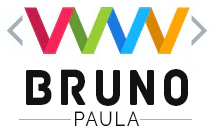

[![Issues][issues-shield]][issues-url]
[![MIT License][license-shield]][license-url]
[![LinkedIn][linkedin-shield]][linkedin-url]

<!-- PROJECT LOGO -->
<br />
<p align="center">
  <a href="https://github.com/othneildrew/Best-README-Template">
    
  </a>

  <h3 align="center">CRM DEMO API</h3>
   <h5 align="center">by</h5>

  <p align="center">
  <a href="https://brunopaula.com">Bruno Paula</a>
  
 
  
</p>

  <p align="center">
    An awesome CRM project!
    <br />
    <a href="https://adonisjs.com/docs"><strong>Explore the docs »</strong></a>
    <br />
    <br />
    <a href="https://dryserv-portal.netlify.app/">View Demo</a>
    ·
    <a href="https://github.com/devbrunopaula">Report Bug</a>
    ·
    <a href="https://github.com/devbrunopaula">Request Feature</a>
  </p>
</p>

<!-- TABLE OF CONTENTS -->

## Table of Contents

- [About the Project](#about-the-project)
  - [Built With](#built-with)
- [Getting Started](#getting-started)
  - [Prerequisites](#Setup)
  - [Installation](#Migrations)
- [Usage](#usage)
- [Roadmap](#roadmap)
- [Contributing](#contributing)
- [License](#license)
- [Contact](#contact)
- [Acknowledgements](#acknowledgements)

<!-- ABOUT THE PROJECT -->

## About The Project

[![Product Name Screen Shot][product-screenshot]](https://dryserv-portal.netlify.app)

Learn How a CRM System Can Help Your Business Today..

Here's why:

- Easy intergration
- Ease of use
- Easy reporting & overviews

Watching your buisness grow is not just fun, but also a key part of planning for the future. A good CRM should let you analyze customer & employee activites and use the information for the benefit of your company. This is why the CRM you choose should have reporting and tracking features.

If you're thinking of moving your business to the next level, you should seriously consider choosing an online CRM system. Don't worry about the cost: many CRM systems.

### Built With

This section should list any major frameworks that you built your project using. Leave any add-ons/plugins for the acknowledgements section. Here are a few examples.

- [AdonisJS](https://adonisjs.com/)

1. Bodyparser
2. Session
3. Authentication
4. Web security middleware
5. CORS
6. Edge template engine
7. Lucid ORM
8. Migrations and seeds

<!-- GETTING STARTED -->

## Getting Started

This is an example of how you may give instructions on setting up your project locally.
To get a local copy up and running follow these simple example steps.

## Setup

Use the adonis command to install the blueprint

```bash
adonis new yardstick
```

or manually clone the repo and then run `npm install`.

### Migrations

Run the following command to run startup migrations.

```js
adonis migration:run
```

<!-- USAGE EXAMPLES -->

## Usage

Use this space to show useful examples of how a project can be used. Additional screenshots, code examples and demos work well in this space. You may also link to more resources.

_For more examples, please refer to the [Documentation](https://adonisjs.com/docs)_

<!-- ROADMAP -->

## Roadmap

See the [open issues](https://github.com/devbrunopaula) for a list of proposed features (and known issues).

<!-- CONTRIBUTING -->

## Contributing

Contributions are what make the open source community such an amazing place to be learn, inspire, and create. Any contributions you make are **greatly appreciated**.

1. Fork the Project
2. Create your Feature Branch (`git checkout -b feature/AmazingFeature`)
3. Commit your Changes (`git commit -m 'Add some AmazingFeature'`)
4. Push to the Branch (`git push origin feature/AmazingFeature`)
5. Open a Pull Request

<!-- LICENSE -->

## License

Distributed under the MIT License. See `LICENSE` for more information.

<!-- CONTACT -->

## Contact

Your Name - [@devbrunopaula](https://twitter.com/your_username) - devbrunopaula@gmail.com.com

Project Link: [https://github.com/devbrunopaula/CRM-API](https://github.com/devbrunopaula/CRM-API)

<!-- ACKNOWLEDGEMENTS -->

## Acknowledgements

- [Bruno Paula](https://brunopaula.com)
- [Adonis JS](https://adonisjs.com/)
- [Knex](http://knexjs.org/)
- [Postgres](https://www.postgresql.org/)
- [ChanceJS](http://chancejs.com/)
- [Animate.css](https://daneden.github.io/animate.css)
- [Loaders.css](https://connoratherton.com/loaders)
- [Slick Carousel](https://kenwheeler.github.io/slick)
- [Smooth Scroll](https://github.com/cferdinandi/smooth-scroll)
- [Sticky Kit](http://leafo.net/sticky-kit)
- [JVectorMap](http://jvectormap.com)
- [Font Awesome](https://fontawesome.com)

<!-- MARKDOWN LINKS & IMAGES -->
<!-- https://www.markdownguide.org/basic-syntax/#reference-style-links -->

[issues-shield]: https://img.shields.io/github/issues/othneildrew/Best-README-Template.svg?style=flat-square
[issues-url]: https://github.com/othneildrew/Best-README-Template/issues
[license-shield]: https://img.shields.io/github/license/othneildrew/Best-README-Template.svg?style=flat-square
[license-url]: https://github.com/othneildrew/Best-README-Template/blob/master/LICENSE.txt
[linkedin-shield]: https://img.shields.io/badge/-LinkedIn-black.svg?style=flat-square&logo=linkedin&colorB=555
[linkedin-url]: https://www.linkedin.com/in/bruno-paula/
[product-screenshot]: screenshot.png

---
